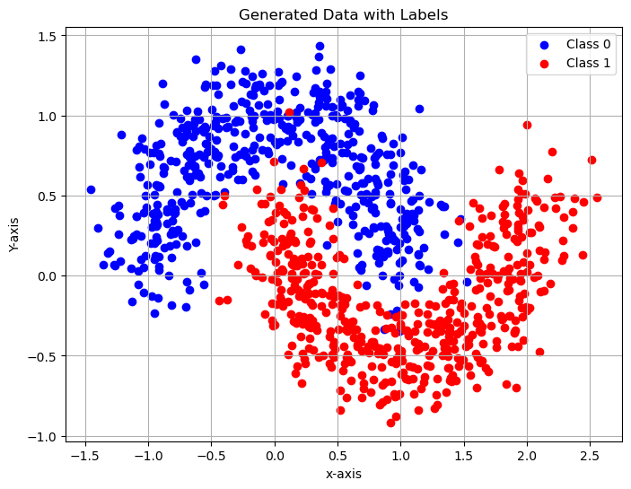
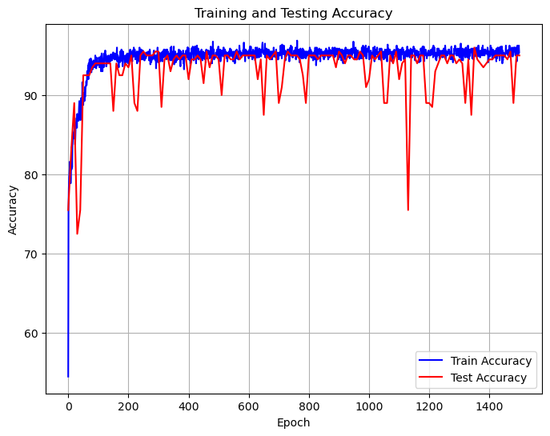

# CS324 DL Assignment 1 Report

Student: 余坤屹 Yu Kunyi 12013027

Main Subject: Perceptron, and Multiple Layer Perceptron (MLP)

Due: 28th of March 2024 at 23:55

----


[TOC]

File structure:

```cmd
.
├── Part_1
│   └── perceptron.py
├── Part_2
│   ├── main.ipynb
│   ├── mlp_numpy.py
│   ├── modules.py
│   ├── readme.md
│   └── train_mlp_numpy.py
├── Report
│   └── ...  // some others
└── ...  // some others
```


## ➤ Part 1 Perceptron

**How to run:** 

​	`python ./Part_1/perceptron.py`

### 1.1 Code review

**(1) Generate a dataset of points, in Gaussian distributions**

​	The points set has two part of points, which have centers of (30, 27) and (10, 7), standard deviations of (1, 10) and (3, 3) for each part (these data is variable).

```python
    dataset = []
    centers = [[30, 27], [10, 7]]
    stds = [[1, 10], [3, 3]]
    for i in range(100):
        x0 = np.random.normal(centers[0][0], stds[0][0])
        y0 = np.random.normal(centers[0][1], stds[0][1])
        x1 = np.random.normal(centers[1][0], stds[1][0])
        y1 = np.random.normal(centers[1][1], stds[1][1])
        dataset.append([x0, y0, -1])
        dataset.append([x1, y1, +1])
    dataset_train = np.array(dataset[:160])
    dataset_test = np.array(dataset[160:])
```

**(2) Implement the perceptron**

​	The core part is the function `train(self, ...)`, which contains train (forward and calculate gradient), test, and output accuracy.

```python
class Perceptron(object):  # not full code
    def __init__(self, n_inputs, max_epochs=1e3, learning_rate=1e-2):
        self.weights = np.zeros(n_inputs)
        self.bias = 0
    def forward(self, input_vec) -> int:
        return np.sign(np.dot(input_vec, self.weights) + self.bias)
    def train(self, training_inputs, labels, test_inputs=None, test_labels=None) -> list:
        n = len(training_inputs)
        accuracy = [[], []]
        for epoch in range(self.max_epochs):
            # train
            count = 0
            grad = np.zeros(self.weights.shape)
            grad_bias = 0
            for xi, yi in zip(training_inputs, labels):
                prediction = self.forward(xi)
                if prediction != yi:
                    grad -= xi * yi
                    grad_bias -= yi
                    count += 1
            grad /= n
            grad_bias /= n
            self.weights -= self.learning_rate * grad
            self.bias -= self.learning_rate * grad_bias
            accuracy[0].append((n - count) / n)
            # test
            if test_inputs is not None and test_labels is not None:
                accuracy[1].append(self.test(test_inputs, test_labels))
            # output
            if epoch % 100 == 0:
                print("epoch", epoch, "- wrong:", count)
        return accuracy
    def test(self, test_inputs, test_labels) -> float:
      	...
    def get_k_b(self):
        ...
```

**(3) Train and Test**

```python
		perceptron = Perceptron(np.shape(dataset_train[0][:-1]))
    acc = perceptron.train(list(dataset_train[:, :-1]), dataset_train[:, -1:],
                           list(dataset_train[:, :-1]), dataset_train[:, -1:])
    acc_train, acc_test = acc[0], acc[1]
```

**(4) Plots. Regular, not show here.**


### 1.2 Results and analysis

**Question**: Experiment with different sets of points (generated as described in Task 1). What happens during the training if the means of the <u>two Gaussians are too close</u> and/or if their <u>variance is too high</u>?

**(1) Normal situation**

Settings:

```python
centers = [[30, 27], [10, 7]]
stds = [[1, 10], [3, 3]]
```

Results:

| Points Map              | Accuracy Curve          |
| ----------------------- | ----------------------- |
|  |  |

Analysis:

​	At first, the model fluctuated as a large scale in the perspective of accuracy.

​	At last, the model converged to 100% accuracy, which means the model can handle this problem.

**(2) Two Gaussians are too close**

Settings:

```python
centers = [[30, 30], [28, 28]]
stds = [[1, 1], [1, 1]]
```

Results:

| Points Map              | Accuracy Curve          |
| ----------------------- | ----------------------- |
|  |  |

Analysis:

​	The model can not converge. ❌

**(3) Variance is too high**

Settings:

```python
centers = [[30, 27], [10, 7]]
stds = [[10, 10], [15, 15]]
```

Results:

| Points Map              | Accuracy Curve          |
| ----------------------- | ----------------------- |
|  |  |

Analysis:

​	The model can not converge. ❌

**(4) Summary**

​	When two point sets are separately, both human and the linear model (single layer perceptron) can distinguish the diff between the sets. Nonetheless, if the <u>two Gaussians are too close</u> and/or if their <u>variance is too high</u>, it is impossible for all to separate points. As a result, the model could not coverage or reach a good solution.


## ➤ Part 2 MLP, Batch

**How to run:** 

* Way 1: `python ./Part_2/train_mlp_numpy.py --use_batch True`
* Way 2: run instructions in `./Part_2/main.ipynb`

### 2.1 Code review

**(1) `module.py` structure (details omitted)**

​	All are basic layers of a Multi-layer Perceptron (MLP)

```python
class Linear(object):
    def __init__(self, in_features, out_features, learning_rate=1e-2):
    def forward(self, x):
    def backward(self, dout):
    def update(self):
    def __call__(self, x):

class ReLU(object):
    def __init__(self):
    def forward(self, x):
    def backward(self, dout):
    def __call__(self, x):

class SoftMax(object):
    def forward(self, x: np.ndarray):
    def backward(self, dout):
    def __call__(self, x):

class CrossEntropy(object):
    def forward(self, x: np.ndarray, y: np.ndarray):
    def backward(self, x, y):
    def __call__(self, x, y):
```

**(2) `mlp_numpy.py` full code (import from `module.py`)**

​	Forward in the order of [input -> hidden -> output]

​	Backward in the order of [output -> hidden -> input]

```python
class MLP(object):
        input_layer = [Linear(n_inputs, n_hidden[0], learning_rate), ReLU()]
        hidden_layers = []
        output_layer = [Linear(n_hidden[-1], n_classes, learning_rate), SoftMax()]
        for i in range(len(n_hidden) - 1):
            hidden_layers += [Linear(n_hidden[i], n_hidden[i + 1], learning_rate), ReLU()]
        self.layers = input_layer + hidden_layers + output_layer
        self.loss_fn = CrossEntropy()
    def forward(self, x: np.ndarray) -> np.ndarray:
        out = x
        for layer in self.layers:
            out = layer(out)  # __call__() will invoke def forward()
        return out
    def backward(self, dout: np.ndarray) -> None:
        for layer in reversed(self.layers):
            dout = layer.backward(dout)
    def update(self):
        for layer in reversed(self.layers):
            if 'Linear' in str(type(layer)):
                layer.update()
    def __call__(self, x: np.ndarray) -> np.ndarray:
      	return self.forward(x)
```

**(3) `train_mlp_numpy.py` structure (import from `mlp_numpy.py`)**

​	Utility functions structure

```python
def accuracy(predictions, targets):  # accuracy of right number
def counter(predictions, targets):  # count right number
def plots(dataset, labels, acc_train, acc_test, loss_train, loss_test):
    # plot 1, point map [Using ChatGPT]
    # plot 2, accuracy curve (train + test) [Using ChatGPT]
    # plot 3, loss curve (train + test) [Using ChatGPT]
```

​	Core function `train()` structure:

```python
def train(dnn_hidden_units: str, learning_rate: float, max_steps: int, eval_freq: int, draw_plots: bool,
          use_batch: bool, stochastic_size: int):
  	# create dataset, then split
    dataset, labels = datasets.make_moons(n_samples=(500, 500), shuffle=True, noise=0.2, random_state=SEED_DEFAULT)  # make_moons
    # split dataset
    labels_train_oh = np.array([[1, 0] if i == 0 else [0, 1] for i in labels_train])  # one_hot (oh here)
    labels_test_oh = ...
		# create MLP instance
    hidden_layers = ...
    mlp = MLP(2, hidden_layers, 2, learning_rate)
    loss_fn = mlp.loss_fn
    # train
    for step in range(max_steps):
        if use_batch:  # batch
            pred_oh = mlp(dataset_train)
            loss_train.append(loss_fn(pred_oh, labels_train_oh))
            acc_train.append(accuracy(pred_oh, labels_train_oh))
            dout = loss_fn.backward(pred_oh, labels_train_oh)
            mlp.backward(dout)
            mlp.update()
        else:  # stochastic
            if stochastic_size == 1:# similar, omitted
            else:# similar, omitted
        if step % eval_freq == 0 or step == max_steps - 1:  # test, omitted
    if draw_plots:
        plots(dataset, labels, acc_train, acc_test, loss_train, loss_test)
```

​	Use `main()` to invoke `train()`

```python
def main():
    # some args setting
    train(flags.dnn_hidden_units, flags.learning_rate, flags.max_steps, flags.eval_freq,
          flags.draw_plots, flags.use_batch, flags.stochastic_size)

if __name__ == '__main__':
    main()
```


### 2.2 Results and analysis

**(1) Command Line output sample:**

```cmd
Step: 0, Loss: 557.5666455613724, Accuracy: 47.5
Step: 10, Loss: 1754.01361287073, Accuracy: 47.5
Step: 20, Loss: 591.6212434589279, Accuracy: 87.0
...
Step: 1499, Loss: 266.50884791013317, Accuracy: 87.0
Training complete!
```

**(2) Point map, Line charts, and Analysis**

| Accuracy Curve            | Loss Curve                                                   |
| ------------------------- | ------------------------------------------------------------ |
|    |                                       |
| **Points Map (Original)** | **Analysis**                                                 |
|    | 1. The noise is 0.2, so two point set have a relatively big area of overlapping, which let the problem become harder.<br />2. Both the curve of Accuracy and Loss shows **a good convergence** after a short period of learning process.<br />3. Final accuracy rate is **near 90%**<br />4. Final loss is **lower than 400** and **<90% of the initial loss**<br />5. The performance of the model is **acceptable** |


## ➤ Part 3 MLP, Stochastic

**How to run:** 

* Way 1: `python ./Part_2/train_mlp_numpy.py --use_batch False --stochastic_size 20` (or other size from 1 to 800)
* Way 2: run instructions in `./Part_2/main.ipynb`

### 3.1 Code review

**(1) Only difference to Part 2 (batch way), in `train_mlp_numpy.py`**

```python
        # stochastic
        else:
            loss = 0
            count_right = 0
            indices = np.random.permutation(len(dataset_train))  # shuffle in the same order
            xs = dataset_train[indices]
            ys = labels_train_oh[indices]
            if stochastic_size == 1:
                for eg, y in zip(dataset_train, labels_train_oh):
										# batch size of 1
            else:
                for i in range(0, len(dataset_train), stochastic_size):
                    # batch size of specific integer
            loss_train.append(loss)
            acc_train.append(count_right / len(dataset_train) * 100)
```


### 3.2 Results and analysis

* All the results of [batch_size = 1, 20, 50] are same to Part 2 (batch way). *More figures could be found at **Appendix***.
* Although the gradients of each sample in Stochastic training may have large variance, the average direction of these gradients is usually consistent.
* The distribution of the training data is the same, so the results are similar.
* Only when [batch_size = 1], The model is not very stable. However, the result is accecptable


## ➤ Part 4 Theoretical analysis

### 4.1 Learning

**Learning process of the perceptron**


### 4.2 Forward and backward propagation

**Forward and backward propagation of layers in MLP**


## ➤ Acknowledgement

I would like to thank Prof.Zhang, Ms.Wang and all TAs for their excellent work. 👏😀👏


## ➤ Appendix

### 1 More figures of 3.2

​	You can find source figures in `./Part_2/main.ipynb`

(1) Stochastic with batch_size = 1

| Accuracy Curve       | Loss Curve           |
| -------------------- | -------------------- |
|  |  |

(2) Stochastic with batch_size = 20

| Accuracy Curve       | Loss Curve           |
| -------------------- | -------------------- |
|  |  |

(3) Stochastic with batch_size = 50

| Accuracy Curve       | Loss Curve           |
| -------------------- | -------------------- |
|  |  |