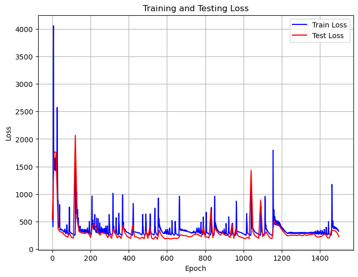
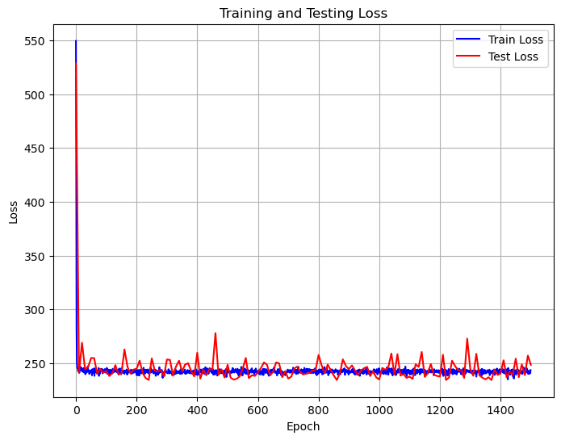

# CS324 DL Assignment 1 Report

Student: 余坤屹 Yu Kunyi 12013027

Main Subject: Perceptron, and Multiple Layer Perceptron (MLP)

Due: 28th of March 2024 at 23:55

----

[TOC]

File structure:

```cmd
├── Part_1
│   └── perceptron.py
├── Part_2
│   ├── main.ipynb
│   ├── mlp_numpy.py
│   ├── modules.py
│   ├── readme.md
│   └── train_mlp_numpy.py
├── Report
│   └── ...  // others
└── ...  // others
```


## ➤ Introduction

The purpose of this lab assignment is to introduce the **perceptron**, a fundamental algorithm in supervised learning for binary classification tasks. A binary classifier determines whether an input, typically represented as a vector of numerical features, belongs to a specific class or not.

**In Assignment 1 Part 1**, we were tasked with implementing a perceptron model with only two layers and training it to classify points generated from normal distributions.

**In Assignment 1 Part 2**, the objective was to extend our implementation to a multi-layer perceptron (MLP) capable of handling various parameters. Jupyter notebook was used to present our results.

Having completed all parts of the assignment, I present this report summarizing the outcomes and findings of Assignment 1.


## ➤ Part 1 Perceptron

**How to run:** 

​	`python ./Part_1/perceptron.py`

### 1.1 Code review

#### Task 1

**Generate a dataset of points, in Gaussian distributions**

​	At the very beginning of Task 1, we need to generate a dataset of points. Here, I use two different *Gaussian Distributions (1)* in both x-axis and y-axis for these two point sets distribution. The distributions will have different **mean** and **covariance**, so point sets will have different centers and distribution size.
$$
X ∼ N(\mu, \sigma^2)
$$
​	During the training process, I adjust the value of mean and covariance to test the perceptron model's performance, stability, and generalization capability. The default values of mean are (30, 27) and (10, 7), covariance are (1, 10) and (3, 3).

​	As for implementation details, I used NumPy library. Firstly, I use `np.random.normal()` to generate Gaussian Distributions. Using acquired 200 points, I append them into a dataset list with their labels `-1` or `1`.  Then I split the dataset into two parts, training and testing, in the ratio of 8 : 2, which has 80 and 20 points for each labels.

#### Task 2

**Implement the perceptron**

​	Followed the instructions, I implement the functions of perceptron and train/test process.

​	The implementations of perceptron could be split into several functions: `__init__()`, `forward()`, `train()`, `test()`, and `get_k_b()`. Firstly, `__init__()` will initialize a perceptron object. The `weights` and `bias` are spited into two part differing from the perceptronslides.pdf suggestion and both are set as zero(s). Secondly, `forward()` function simply calculate $\hat{y} = wX + b$ to output predictions of the model. Two NumPy functions, `np.sign()` and `np.dot()`, are used. Thirdly, `train()` function is the most important function of all. In each epoch, gradients of `weights` and `bias` will be calculate after invoking `forward()`. Then parameters will update in a specific `learning_rate`. The function will also invoke `test()` in each epoch and print accuracy rate in command line windows. Fourthly, `test()` function is designed to count the difference between predictions and true labels. Lastly, `get_k_b()` is a custom functions to benefit drawing plots. The gradients show as below:
$$
\bigtriangledown_w L(w, b) = - \sum_{x_i \in M}y_i x_i \\
\bigtriangledown_b L(w, b) = - \sum_{x_i \in M}y_i
$$

#### Task 3

**Train and Test**

​	The implementations of train/test process. Because the dataset is prepared already, I just create an instance of `Perceptron` then invoke the function `train()` with inputs in suitable format. The result of `train()` is two list of accuracy of train and test periods which could be convert to graphical representations (line charts).

#### Task 4

**Plots**

​	Easy-peasy, not show here. Using a python library `matplotlib.pyplot`


### 1.2 Experiments and analysis

**Question**

​	Experiment with different sets of points (generated as described in Task 1). What happens during the training if the means of the <u>two Gaussians are too close</u> and/or if their <u>variance is too high</u>?

**Plots**

​	could be found at Appendix.

**Experiments**

|                       | Mean 1   | Covariance 1 | Mean 2   | Covariance 2 | Accuracy                    |
| --------------------- | -------- | ------------ | -------- | ------------ | --------------------------- |
| **Regular**           | [30, 27] | [1, 10]      | [10, 7]  | [3, 3]       | 100%                        |
| **Too close**         | [30, 30] | [1, 1]       | [28, 28] | [1, 1]       | 50%                         |
| **Variance too high** | [30, 27] | [10, 10]     | [10, 7]  | [15, 15]     | 50% - 75%, can not converge |

**Analysis**

​	I did the above experiment with a lot of different sets of different Gaussian distributions. When two point sets are separately, both human and the linear model (single layer perceptron) can distinguish the diff between the sets. Nonetheless, if the <u>two Gaussians are too close</u> and/or if their <u>variance is too high</u>, it is impossible for both to separate points. As a result, the model could not coverage or reach a good solution.


## ➤ Part 2 MLP, Batch

**How to run:** 

* Way 1: `python ./Part_2/train_mlp_numpy.py --use_batch True`
* Way 2: run instructions in `./Part_2/main.ipynb`

### 2.1 Code review

​	Differ from Part 1, this part we should implement a multi-layer perceptron (MLP) while preparing dataset and training/testing the performance of the MLP. Three `.py` files included in this Part, located in `./Part_2`, are `modules.py`, `mlp_numpy.py`, and `train_mlp_numpy.py`. Remarkably, `modules.py` is the most underlying one and `train_mlp_numpy.py` is the top one with `main()` entry.

#### Task 1

**`module.py`**

​	There are 4 basic layers of a Multi-layer Perceptron (MLP), `Linear`, `ReLu`, `SoftMax`, and `CrossEntropy`. All of these layers have function `forward()`, `backward()`, and `__call__()`, which are used to calculate output, gradients, and directly invoke function `forward()` separately. Some of layers have function `__init__()`. The `Linear` layer has a function `update()` to renew the parameters according to the upstream layer's gradient and stored input `x`.

**`module.py`** Linear Layer

```python
class Linear(object):
    def __init__(self, in_features, out_features, learning_rate=1e-2):
    def forward(self, x):
    def backward(self, dout):
    def update(self):
    def __call__(self, x):
```

​	In the function `__init__()`, I initialize the parameters and gradients of it and both of them contains two parts, `weight` and `bias`. Moreover, the function `forward()`, as the name shows, simply outputs the forward propagation of this linear layer and store the input data using `self.x = x`. The mathematical formula is $\hat{y} = Wx + b$. What is more, the function `backward()` will calculate gradient and save the values until `update()` use it to renew the parameters of this linear layer. The mathematical formulas of `backward()` show as below:
$$
\text{Gradient}_w = x^T ∗ dout \\
\text{Gradient}_b = dout \\
dx = dout ∗ w^T \\
$$
​	Where $dout$ is the upstream gradient and $*$ means matrix multiple (compare to element-wise multiple).

​	Lastly, the function `update()` will follow the formulas below:
$$
w = w - \text{learning\_rate} * \text{Gradient}_w \\
b = b - \text{learning\_rate} * \text{Gradient}_b
$$
**`module.py`** ReLu Layer

```python
class ReLU(object):
    def __init__(self):
    def forward(self, x):
    def backward(self, dout):
    def __call__(self, x):
```

​	ReLu function is a common-used activate function and could only forward the positive part of its inputs. The function `forward()` contains a line of code `return np.maximum(x, 0)` to realize the requirement. The gradient of the function shows as below:
$$
\text{Gradient} = \begin{cases}
0,& \text{when } x \leq 0\\
1,& \text{when } x > 0
\end{cases}
$$
​	Considering the upstream gradient `dout`, The backward propagation will be `return np.where(self.x > 0, dout, 0)`

**`module.py`** SoftMax Layer

```python
class SoftMax(object):
    def forward(self, x: np.ndarray):
    def backward(self, dout):
    def __call__(self, x):
```

​	SoftMax function is another common-used activate function for the output layer. It could normalize the output of a network to a probability distribution over predicted output classes, based on Luce's choice axiom. The function `forward()` follows the mathematical formula below:
$$
\text{SoftMax}(x_i) = \frac{e^{x_i}}{\sum_{j=1}^{N}e^{x_j}}
$$
​	My implementation of the function `forward()` is robust because it could handle batch forward propagation. Codes:

```python
    def forward(self, x: np.ndarray):
        exp_x = np.exp(x - np.max(x, axis=-1, keepdims=True))
        return exp_x / np.sum(exp_x, axis=-1, keepdims=True)
```

​	As for the backward propagation, it is merged with the class `CrossEntropy` to achieve a simpler mathematical formula.

**`module.py`** CrossEntropy Layer

```python
class CrossEntropy(object):
    def forward(self, x: np.ndarray, y: np.ndarray):
    def backward(self, x, y):
    def __call__(self, x, y):
```

​	Cross entropy can be used as a loss function in neural networks, where $p$ represents the distribution of true labels and $q$ is the distribution of predictions of a model, and the cross entropy loss function can measure the similarity between $p$ and $q$. In our implementation, the function `forward()` will calculate the loss value of present prediction with true labels by following the formula below:
$$
L(x^{(N)}, t) = - \sum_i t_i \log x_i^{(N)}
$$
​	Or in code: `return -np.sum(y * np.log(x))`. As for the backward propagation part along with function SoftMax, it simply is the predictions minus true labels, or in code: `return x - y`.

**`mlp_numpy.py`**

```python
class MLP(object):
    def __init__(self, n_inputs: int, n_hidden: List[int], n_classes: int, learning_rate=1e-2):
    def forward(self, x: np.ndarray) -> np.ndarray:
    def backward(self, dout: np.ndarray) -> None:
    def update(self):
    def __call__(self, x: np.ndarray) -> np.ndarray:
```

​	The class `MLP` stipulate the layer structure of the model, rule of forward propagation, rule of backward propagation, and update parameters. In a nutshell, the input layer's shape of MLP could multiple with input data, and the output is the number of distinct types of labels (here, 2).

​	Forward in the order of [input -> hidden -> output]

​	Backward in the order of [output -> hidden -> input]


#### Task 2

**`train_mlp_numpy.py` **

```python
def accuracy(predictions, targets):
def counter(predictions, targets):
def plots(dataset, labels, acc_train, acc_test, loss_train, loss_test):
def train(dnn_hidden_units: str, learning_rate: float, max_steps: int, eval_freq: int, draw_plots: bool,
          use_batch: bool, stochastic_size: int):
def main():
if __name__ == '__main__':
    main()
```

​	This is the main entry of whole MLP training and testing process. The python process will begin from `if __name__ == '__main__'` to invoke the function `main()` where seed maybe set to a fix number, and configuration will read to wait further use.  The function `train()` will be invoked by function `main()` after all configs are prepared well.

​	Three utility functions `accuracy()`, `counter()`, and `plots()` 's usage are calculating accuracy, counting the total right number, and drawing some analysis plots (a point map and two line charts) separately.

​	The core of whole is the function `train()`. At the very beginning of it, I import a useful python library `sklearn` to help me construct a point dataset. I used `sklearn.datasets.make_moons()` to generate 1000 points in two equal number parts of points (500 and 500 separately). The dataset is labeled, shuffled, and with a noise of 0.2 which could raise the complexity of logistic regression problem. Then, I used `sklearn.model_selection.train_test_split()` to split the dataset into training and testing two parts in the ratio of 8 : 2. Moreover, I encode the labels into one-hot format. At the last part of preparation period, The process generate a MLP instance with default weight and bias. [TRAINING PROCESS (see below)]. Finally, it will invoke function `plots()` to output the results and plots.

​	**\[TRAINING PROCESS\]** (batch)

```python
   for step in range(max_steps):     
        pred_oh = mlp(dataset_train)
        loss_train.append(loss_fn(pred_oh, labels_train_oh))
        acc_train.append(accuracy(pred_oh, labels_train_oh))
        dout = loss_fn.backward(pred_oh, labels_train_oh)
        mlp.backward(dout)
        mlp.update()
```

​	As shown in the semantic code above, the training process has mainly four steps [1] predict, [2] loss forward and calculate accuracy, [3] loss backward and MLP backward, [4] update MLP parameters. Remarkably, the input data `dataset_train` is a whole of all training data, so the process may be considered as batch_size = 800 in default settings.


### 2.2 Experiments and analysis

**Command Line output sample**

```cmd
use_batch=True, stochastic_size=50
Step: 0, Loss: 554.7744571113598, Accuracy: 47.0
Step: 10, Loss: 1768.9171659279718, Accuracy: 47.0
...
Step: 1490, Loss: 297.910208178201, Accuracy: 89.0
Step: 1499, Loss: 223.51042434262368, Accuracy: 90.0
Training complete!
```

**Plots**

| Accuracy Curve          | Loss Curve              | Points Map (Original)   |
| ----------------------- | ----------------------- | ----------------------- |
|  |  |  |

**Analysis**

1. The noise is 0.2, so two point set have a relatively big area of overlapping, which let the problem become harder.
2. **Training speed**: The speed is very good.
3. **Convergence**: Both the curve of Accuracy and Loss shows unacceptable performance of **convergences** ❌. This result may due to the batch size = 800, a relative large number, and learning_rate = 0.01. Weight update for each epoch is too large.
4. **Accuracy**: Final **training accuracy rate** is around **85.0%**, while **test accuracy rate** is around **90.0%**.
5. **Loss**: Final **training and test loss** is **lower than 400** and **near 10% of the initial loss**
6. **Summary**: The performance of the model is **average**, but not the **stability** is not good.

**Possible Improvement methods**

1. Decrease the learning_rate when $epoch = max\_epoch / 2$​
2. Use stochastic way to decrease the batch size


## ➤ Part 2 MLP, Stochastic

**How to run:** 

* Way 1: `python ./Part_2/train_mlp_numpy.py --use_batch False --stochastic_size 20` (or other size from 1 to 800)
* Way 2: run instructions in `./Part_2/main.ipynb`

### 2.3 Code review

**`train_mlp_numpy.py`** difference to the batch way (in 2.1)

​	**\[TRAINING PROCESS\]** (stochastic)

​	Most parts of training process of stochastic is similar to batch way. However, stochastic way will firstly shuffle the order of input data, which will guarantee the robust of model while the distribution of input is same. What is more, stochastic way could change batch size from 1 to any specific integer (here, I use 1, 10, 25 to accomplish my experiments). After each batch, the weights of model will update immediately.

​	To gain a better performance, I manually set a checker rule of update: If the prediction of a batch fully match the rule label, not weight update will conduct. In another word, weights will only update in the case of wrong prediction.

### 2.4 Experiments and analysis

**Experiments Setting**

​	I conduct three rounds of experiment. All of them used stochastic way to train and update weight. The batch sizes of them are 1, 10, 25, respectively. 

**Plots**

​	could be found at Appendix.

**Analysis**

1. **Training speed**: Smaller batch size (e.g. 1) could cause a slower training speed as the serial computation does not make full use of computer resources.
2. **Convergence**: All is well.
3. **Accuracy**: The accuracy curves show that both of them achieved better regression performances compared to batch way. For most cases, stochastic way could have a >95% accuracy in both training and testing set.
4. **Loss**: The loss values of the three settings are steadily decreasing, and the batch_size=1 case is decreasing slowly. In the final loss value comparison, the batch_size=1 case is 543.0, and the batch_size=10 case is >250.0, batch_size=25 is about 75.0, which indicates that appropriately adjusting batch_size is more conducive to the reduction of loss.
5. **Summary**: The model could stably achieve a good performance in stochastic way. 


## ➤ Acknowledgement

I would like to thank Prof.Zhang, Dor.Wang and all TAs for their excellent work. 👏😀👏


## ➤ Appendix

### More figures of 1.2

**Group 1** Regular

| Points Map              | Accuracy Curve          |
| ----------------------- | ----------------------- |
|  |  |

**Group 2** Two Gaussians are too close

| Points Map              | Accuracy Curve          |
| ----------------------- | ----------------------- |
|  |  |

**Group 3** Variance is too high

| Points Map              | Accuracy Curve          |
| ----------------------- | ----------------------- |
|  |  |


### More figures of 2.4

​	You can find source figures in `./Part_2/main.ipynb`

**Group 1** Stochastic with batch_size = 1

| Accuracy Curve       | Loss Curve           |
| -------------------- | -------------------- |
|  |  |

**Group 2** Stochastic with batch_size = 10

| Accuracy Curve       | Loss Curve           |
| -------------------- | -------------------- |
|  |  |

**Group 3** Stochastic with batch_size = 25

| Accuracy Curve       | Loss Curve           |
| -------------------- | -------------------- |
|  |  |