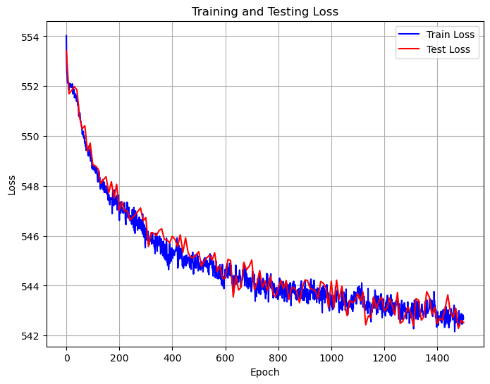
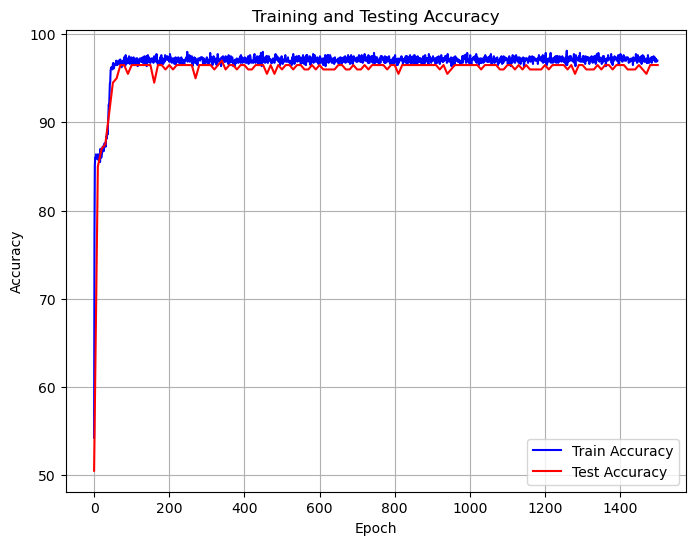

# CS324 DL Assignment 1 Report

Student: 余坤屹 Yu Kunyi 12013027

Main Subject: Perceptron, and Multiple Layer Perceptron (MLP)

Due: 28th of March 2024 at 23:55

----

[TOC]

File structure:

```cmd
├── Part_1
│   └── perceptron.py
├── Part_2
│   ├── main.ipynb
│   ├── mlp_numpy.py
│   ├── modules.py
│   ├── readme.md
│   └── train_mlp_numpy.py
├── Report
│   └── ...  // others
└── ...  // others
```


## ➤ Introduction

The purpose of this lab assignment is to introduce the **perceptron**, a fundamental algorithm in supervised learning for binary classification tasks. A binary classifier determines whether an input, typically represented as a vector of numerical features, belongs to a specific class or not.

**In Assignment 1 Part 1**, we were tasked with implementing a perceptron model with only two layers and training it to classify points generated from normal distributions.

**In Assignment 1 Part 2**, the objective was to extend our implementation to a multi-layer perceptron (MLP) capable of handling various parameters. Jupyter notebook was used to present our results.

Having completed all parts of the assignment, I present this report summarizing the outcomes and findings of Assignment 1.


## ➤ Part 1 Perceptron

**How to run:** 

​	`python ./Part_1/perceptron.py`

### 1.1 Code review

#### Task 1

**Generate a dataset of points, in Gaussian distributions**

​	At the very beginning of Task 1, we need to generate a dataset of points. Here, I use two different *Gaussian Distributions (1)* in both x-axis and y-axis for these two point sets distribution. The distributions will have different **mean** and **covariance**, so point sets will have different centers and distribution size.
$$
X ∼ N(\mu, \sigma^2)
$$
​	During the training process, I adjust the value of mean and covariance to test the perceptron model's performance, stability, and generalization capability. The default values of mean are (30, 27) and (10, 7), covariance are (1, 10) and (3, 3).

​	As for implementation details, I used NumPy library. Firstly, I use `np.random.normal()` to generate Gaussian Distributions. Using acquired 200 points, I append them into a dataset list with their labels `-1` or `1`.  Then I split the dataset into two parts, training and testing, in the ratio of 8 : 2, which has 80 and 20 points for each labels.

#### Task 2

**Implement the perceptron**

​	Followed the instructions, I implement the functions of perceptron and train/test process.

​	The implementations of perceptron could be split into several functions: `__init__()`, `forward()`, `train()`, `test()`, and `get_k_b()`. Firstly, `__init__()` will initialize a perceptron object. The `weights` and `bias` are spited into two part differing from the perceptronslides.pdf suggestion and both are set as zero(s). Secondly, `forward()` function simply calculate $\hat{y} = wX + b$ to output predictions of the model. Two NumPy functions, `np.sign()` and `np.dot()`, are used. Thirdly, `train()` function is the most important function of all. In each epoch, gradients of `weights` and `bias` will be calculate after invoking `forward()`. Then parameters will update in a specific `learning_rate`. The function will also invoke `test()` in each epoch and print accuracy rate in command line windows. Fourthly, `test()` function is designed to count the difference between predictions and true labels. Lastly, `get_k_b()` is a custom functions to benefit drawing plots. The gradients show as below:
$$
\bigtriangledown_w L(w, b) = - \sum_{x_i \in M}y_i x_i \\
\bigtriangledown_b L(w, b) = - \sum_{x_i \in M}y_i
$$

#### Task 3

**Train and Test**

​	The implementations of train/test process. Because the dataset is prepared already, I just create an instance of `Perceptron` then invoke the function `train()` with inputs in suitable format. The result of `train()` is two list of accuracy of train and test periods which could be convert to graphical representations (line charts).

#### Task 4

**Plots**

​	Easy-peasy, not show here. Using a python library `matplotlib.pyplot`


### 1.2 Experiments and analysis

**Question**

​	Experiment with different sets of points (generated as described in Task 1). What happens during the training if the means of the <u>two Gaussians are too close</u> and/or if their <u>variance is too high</u>?

**Experiments**

|                       | Mean 1   | Covariance 1 | Mean 2   | Covariance 2 | Accuracy                    |
| --------------------- | -------- | ------------ | -------- | ------------ | --------------------------- |
| **Regular**           | [30, 27] | [1, 10]      | [10, 7]  | [3, 3]       | 100%                        |
| **Too close**         | [30, 30] | [1, 1]       | [28, 28] | [1, 1]       | 50%                         |
| **Variance too high** | [30, 27] | [10, 10]     | [10, 7]  | [15, 15]     | 50% - 75%, can not converge |

**Analysis**

​	I did the above experiment with a lot of different sets of different Gaussian distributions. When two point sets are separately, both human and the linear model (single layer perceptron) can distinguish the diff between the sets. Nonetheless, if the <u>two Gaussians are too close</u> and/or if their <u>variance is too high</u>, it is impossible for both to separate points. As a result, the model could not coverage or reach a good solution.


## ➤ Part 2 MLP, Batch

**How to run:** 

* Way 1: `python ./Part_2/train_mlp_numpy.py --use_batch True`
* Way 2: run instructions in `./Part_2/main.ipynb`

### 2.1 Code review

​	Differ from Part 1, this part we should implement a multi-layer perceptron (MLP) while preparing dataset and training/testing the performance of the MLP. Three `.py` files included in this Part, located in `./Part_2`, are `modules.py`, `mlp_numpy.py`, and `train_mlp_numpy.py`. Remarkably, `modules.py` is the most underlying one and `train_mlp_numpy.py` is the top one with `main()` entry.

#### Task 1

**`module.py`**

​	There are 4 basic layers of a Multi-layer Perceptron (MLP), `Linear`, `ReLu`, `SoftMax`, and `CrossEntropy`. All of these layers have function `forward()`, `backward()`, and `__call__()`, which are used to calculate output, gradients, and directly invoke function `forward()` separately. Some of layers have function `__init__()`. The `Linear` layer has a function `update()` to renew the parameters according to the upstream layer's gradient and stored input `x`.

**`module.py`** Linear Layer

```python
class Linear(object):
    def __init__(self, in_features, out_features, learning_rate=1e-2):
    def forward(self, x):
    def backward(self, dout):
    def update(self):
    def __call__(self, x):
```

​	In the function `__init__()`, I initialize the parameters and gradients of it and both of them contains two parts, `weight` and `bias`. Moreover, the function `forward()`, as the name shows, simply outputs the forward propagation of this linear layer and store the input data using `self.x = x`. The mathematical formula is $\hat{y} = Wx + b$. What is more, the function `backward()` will calculate gradient and save the values until `update()` use it to renew the parameters of this linear layer. The mathematical formulas of `backward()` show as below:
$$
\text{Gradient}_w = x^T ∗ dout \\
\text{Gradient}_b = dout \\
dx = dout ∗ w^T \\
$$
​	Where $dout$ is the upstream gradient and $*$ means matrix multiple (compare to element-wise multiple).

​	Lastly, the function `update()` will follow the formulas below:
$$
w = w - \text{learning\_rate} * \text{Gradient}_w \\
b = b - \text{learning\_rate} * \text{Gradient}_b
$$
**`module.py`** ReLu Layer

```python
class ReLU(object):
    def __init__(self):
    def forward(self, x):
    def backward(self, dout):
    def __call__(self, x):
```

​	ReLu function is a common-used activate function and could only forward the positive part of its inputs. The function `forward()` contains a line of code `return np.maximum(x, 0)` to realize the requirement. The gradient of the function shows as below:
$$
\text{Gradient} = \begin{cases}
0,& \text{when } x \leq 0\\
1,& \text{when } x > 0
\end{cases}
$$
​	Considering the upstream gradient `dout`, The backward propagation will be `return np.where(self.x > 0, dout, 0)`

**`module.py`** SoftMax Layer

```python
class SoftMax(object):
    def forward(self, x: np.ndarray):
    def backward(self, dout):
    def __call__(self, x):
```

​	SoftMax function is another common-used activate function for the output layer. It could normalize the output of a network to a probability distribution over predicted output classes, based on Luce's choice axiom. The function `forward()` follows the mathematical formula below:
$$
\text{SoftMax}(x_i) = \frac{e^{x_i}}{\sum_{j=1}^{N}e^{x_j}}
$$
​	My implementation of the function `forward()` is robust because it could handle batch forward propagation. Codes:

```python
    def forward(self, x: np.ndarray):
        exp_x = np.exp(x - np.max(x, axis=-1, keepdims=True))
        return exp_x / np.sum(exp_x, axis=-1, keepdims=True)
```

​	As for the backward propagation, it is merged with the class `CrossEntropy` to achieve a simpler mathematical formula.

**`module.py`** CrossEntropy Layer

```python
class CrossEntropy(object):
    def forward(self, x: np.ndarray, y: np.ndarray):
    def backward(self, x, y):
    def __call__(self, x, y):
```

​	Cross entropy can be used as a loss function in neural networks, where $p$ represents the distribution of true labels and $q$ is the distribution of predictions of a model, and the cross entropy loss function can measure the similarity between $p$ and $q$. In our implementation, the function `forward()` will calculate the loss value of present prediction with true labels by following the formula below:
$$
L(x^{(N)}, t) = - \sum_i t_i \log x_i^{(N)}
$$
​	Or in code: `return -np.sum(y * np.log(x))`. As for the backward propagation part along with function SoftMax, it simply is the predictions minus true labels, or in code: `return x - y`.

**`mlp_numpy.py`**

```python
class MLP(object):
    def __init__(self, n_inputs: int, n_hidden: List[int], n_classes: int, learning_rate=1e-2):
    def forward(self, x: np.ndarray) -> np.ndarray:
    def backward(self, dout: np.ndarray) -> None:
    def update(self):
    def __call__(self, x: np.ndarray) -> np.ndarray:
```

​	The class `MLP` stipulate the layer structure of the model, rule of forward propagation, rule of backward propagation, and update parameters. In a nutshell, the input layer's shape of MLP could multiple with input data, and the output is the number of distinct types of labels (here, 2).

​	Forward in the order of [input -> hidden -> output]

​	Backward in the order of [output -> hidden -> input]


#### Task 2

**`train_mlp_numpy.py` **

```python
def accuracy(predictions, targets):
def counter(predictions, targets):
def plots(dataset, labels, acc_train, acc_test, loss_train, loss_test):
def train(dnn_hidden_units: str, learning_rate: float, max_steps: int, eval_freq: int, draw_plots: bool,
          use_batch: bool, stochastic_size: int):
```

​	


The first thing to train my MLP would be to generate train and test data. As the assignment requires, I used the python package sklearn.datasets.make_moons to generate this data set. I generated 1000 data, shuffle them, record their respective label, and used 80% as train data and 20% as test data. To use their label and include it in the process of training, I used the trick called the one-hot label to encode labels. After I know what this encoding and decoding process means, I wrote two functions: encode and decode to transform labels. The encoding process would change one integer into a 1-D array with length 2: if this integer is 1, then the one hot label should [1, 0], or it should be [0, 1]. And decode function would transform one array back to an integer: is the first value is larger than 0.5, then the answer should be 1, or should be 0. Then I try to use the given argument parser. I found that this could take into four possible parameters including the maximum number of epoch, the list of neurons in hidden layers, the learning rate, and the evaluation frequency, which is used to compute and record accuracy and plot them at the end. So I finished the accuracy evaluation function and prepare to begin training. In this part, I used batch gradient descent as the optimizer. BGD means that this MLP would only update its weight and bias after one epoch, which means all the data has forward and backward once. The detailed implementation is that, during each epoch, first we forward the data one by one. After each data is forwarded, the gradient of weight and gradients of bias computed should be added to a structure which is designed to save all these gradients of each layer, so after all the data is calculated once, we use the sum of the gradient of weight of every linear module, divide by the batch size (in this case is the length of training data), multiplies with learning rate and update each layer’s weight and bias.

```python
def train(dnn_hidden_units: str, learning_rate: float, max_steps: int, eval_freq: int, draw_plots: bool,
          use_batch: bool, stochastic_size: int):
  	# create dataset, then split
    dataset, labels = datasets.make_moons(n_samples=(500, 500), shuffle=True, noise=0.2, random_state=SEED_DEFAULT)  # make_moons
    # split dataset
    labels_train_oh = np.array([[1, 0] if i == 0 else [0, 1] for i in labels_train])  # one_hot (oh here)
    labels_test_oh = ...
		# create MLP instance
    hidden_layers = ...
    mlp = MLP(2, hidden_layers, 2, learning_rate)
    loss_fn = mlp.loss_fn
    # train
    for step in range(max_steps):
        if use_batch:  # batch
            pred_oh = mlp(dataset_train)
            loss_train.append(loss_fn(pred_oh, labels_train_oh))
            acc_train.append(accuracy(pred_oh, labels_train_oh))
            dout = loss_fn.backward(pred_oh, labels_train_oh)
            mlp.backward(dout)
            mlp.update()
        else:  # stochastic
            if stochastic_size == 1:# similar, omitted
            else:# similar, omitted
        if step % eval_freq == 0 or step == max_steps - 1:  # test, omitted
    if draw_plots:
        plots(dataset, labels, acc_train, acc_test, loss_train, loss_test)
```


### 2.2 Experiments and analysis

**(1) Command Line output sample:**

```cmd
Step: 0, Loss: 557.5666455613724, Accuracy: 47.5
Step: 10, Loss: 1754.01361287073, Accuracy: 47.5
Step: 20, Loss: 591.6212434589279, Accuracy: 87.0
...
Step: 1499, Loss: 266.50884791013317, Accuracy: 87.0
Training complete!
```

**(2) Point map, Line charts, and Analysis**

| Accuracy Curve            | Loss Curve                                                   |
| ------------------------- | ------------------------------------------------------------ |
|    |                                       |
| **Points Map (Original)** | **Analysis**                                                 |
|    | 1. The noise is 0.2, so two point set have a relatively big area of overlapping, which let the problem become harder.<br />2. Both the curve of Accuracy and Loss shows **a good convergence** after a short period of learning process.<br />3. Final accuracy rate is 87.0%, **near 90%**<br />4. Final loss is **lower than 400** and **<90% of the initial loss**<br />5. The performance of the model is **acceptable** |


## ➤ Part 2 MLP, Stochastic

**How to run:** 

* Way 1: `python ./Part_2/train_mlp_numpy.py --use_batch False --stochastic_size 20` (or other size from 1 to 800)
* Way 2: run instructions in `./Part_2/main.ipynb`

### 2.3 Code review

**(1) Only difference to Part 2 (batch way), in `train_mlp_numpy.py`**

```python
        # stochastic
        else:
            loss = 0
            count_right = 0
            indices = np.random.permutation(len(dataset_train))  # shuffle in the same order
            xs = dataset_train[indices]
            ys = labels_train_oh[indices]
            if stochastic_size == 1:
                for eg, y in zip(dataset_train, labels_train_oh):
										# batch size of 1
            else:
                for i in range(0, len(dataset_train), stochastic_size):
                    # batch size of specific integer
            loss_train.append(loss)
            acc_train.append(count_right / len(dataset_train) * 100)
```


### 2.4 Experiments and analysis

* All the results of [batch_size = 1, 20, 50] are same to Part 2 (batch way). *More figures could be found at **Appendix***.
* Although the gradients of each sample in Stochastic training may have large variance, the average direction of these gradients is usually consistent.
* The distribution of the training data is the same, so the results are similar.
* Only when [batch_size = 1], The model is not very stable. However, the result is accecptable


## ➤ Acknowledgement

I would like to thank Prof.Zhang, Dor.Wang and all TAs for their excellent work. 👏😀👏


## ➤ Appendix

### More figures of 1.2

**Group 1** Regular

| Points Map              | Accuracy Curve          |
| ----------------------- | ----------------------- |
|  |  |

**Group 2** Two Gaussians are too close

| Points Map              | Accuracy Curve          |
| ----------------------- | ----------------------- |
|  |  |

**Group 3** Variance is too high

| Points Map              | Accuracy Curve          |
| ----------------------- | ----------------------- |
|  |  |


### More figures of 2.4

​	You can find source figures in `./Part_2/main.ipynb`

(1) Stochastic with batch_size = 1

| Accuracy Curve       | Loss Curve           |
| -------------------- | -------------------- |
|  |  |

(2) Stochastic with batch_size = 20

| Accuracy Curve       | Loss Curve           |
| -------------------- | -------------------- |
|  |  |

(3) Stochastic with batch_size = 50

| Accuracy Curve       | Loss Curve           |
| -------------------- | -------------------- |
|  |  |