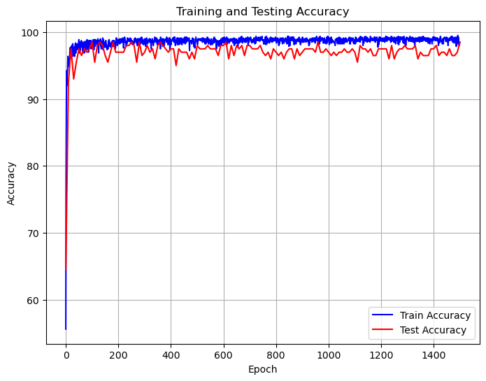

# CS324 DL Assignment 2 Report

Student: 余坤屹 Yu Kunyi 12013027

Main Subject: MLP, CNN, and RNN


[TOC]

## Introduction

The purpose of this lab assignment is to implement **MLP**, **CNN**, and **RNN** models and train these models in different datasets, including `make_moons`, `make_circles`, `CIFAR10`, and `palindrome`. These models fit different application situation due to their internal structure.

Having completed all parts of the assignment, I present this report summarizing the outcomes and findings of Assignment 2.

<div STYLE="page-break-after: always;"></div>

## Part I: PyTorch MLP (30 points)

models: MLP in Numpy version, and MLP in PyTorch version

datasets: `make_moons`, `make_circles`, and `CIFAR10`

File structure:

```cmd
.
├── CIFAR10  												# downloaded dataset
├── cifar10_pytorch_train_mlp.py  	# task 3
├── cifar_mlp_1024,256,32.pth  			# some saved parameters
├── ...
├── cifar_mlp_64.pth
├── main.ipynb											# RUN CODE HERE :)
├── numpy_mlp.py										# assignment 1 code
├── numpy_modules.py
├── numpy_train_mlp.py
├── pytorch_mlp.py  								# task 1 & task 2
├── pytorch_train_mlp.py
└── util.py
```


### 1.1 Task 1

The MLP model in Numpy version was already implemented in assignment 1, as files shown in `numpy_mlp.py`, `numpy_modules.py`, and `numpy_train_mlp.py`.

In this assignment 2, the python code file `pytorch_mlp.py` implement MLP model in PyTorch version. Similarly, the MLP models has `linear` layer, `ReLU` layer, `softmax` layer and `cross-entropy` loss function which are provided by PyTorch. To specify the forward propagation order, the code use `Sequential` class to warp the layers.

As for the train/test part in `pytorch_train_mlp.py`, it's also similar to the implementation in the assignment 1. Notably, in the dataset generation part, two datasets are provided: `make_moons`, `make_circles`. The code splits the dataset into two parts, training and testing, in the ratio of 8 : 2. The total number of both dataset is 1000, so the train data is 800, and test data is 200. The noise of `moons` is `0.2`, while the noise of `circles` is `0.05`, which is set to be able to separate easily by human eyes. Lastly, the training process uses `mini-batch` with batch size of 5 in default.


### 1.2 Task 2

Using a python library `matplotlib.pyplot`, the code shows the result of two version of MLP train/test in two datasets mentioned before.

Results as below, more figures can be found in Appendix.

| id   | Numpy or PyTorch | Dataset      | Final Test Accuracy | Final Test Loss |
| ---- | ---------------- | ------------ | ------------------- | --------------- |
| 1    | Numpy            | make_moons   | 97.5                | 73.04           |
| 2    | Numpy            | make_circles | 96.0                | 84.60           |
| 3    | PyTorch          | make_moons   | 97.0                | **54.85**       |
| 4    | PyTorch          | make_circles | **98.5**            | 56.23           |

Analysis: The results show that two version of MLP can gain very similar results in both datasets. The implementations are right and all of them can converge to a relative good result. PyTorch version can win the game in highest test accuracy and lowest test loss, it is may due to the floating point precision or other optimizations.


### 1.3 Task 3

This task is asked to train/test MLP in a image dataset `CIFAR10`, which contains 10 classes of images, including ` plane, car, bird, cat, deer, dog, frog, horse, ship, and truck`. The total size of the dataset is `50000` training images and `10000` testing images, and each images is a `32 x 32` pixels 3 channels RGB matrix. Training process is similar. Notably, some optimizations were conducted to improve the result. Firstly, the hidden layers structure is variable during experiments. With 1 layer of 256 nodes, it can achieve best performance among others. What is more, as the requirement ask, the code uses `SGD` optimizer, which is much better than the optimizer `Adam` used in task 2. The update formulas of the two optimizers are shown as below, (1) is `Adam` and (2) is `SGD`. Lastly, the learning_rate is `3e-5`.
$$
\theta_{t+1} = \theta_{t} - \frac{\eta}{\sqrt{\hat{v_t}} + \epsilon} \hat{m_t}
$$

$$
\theta_{t+1} = \theta_{t} - \eta\frac{\partial L}{\partial \theta_{t}}
$$

The best performance can gain a accuracy of 43%. Considering the large number of images and low-pixel characteristics, it is not bad but still lower than human being average. Result:

```cmd
Accuracy of the network on the 10000 test images: 43 %
Accuracy for class: plane is 44.8 %
Accuracy for class: car   is 53.0 %
Accuracy for class: bird  is 19.7 %
Accuracy for class: cat   is 33.6 %
Accuracy for class: deer  is 37.9 %
Accuracy for class: dog   is 37.5 %
Accuracy for class: frog  is 42.9 %
Accuracy for class: horse is 55.1 %
Accuracy for class: ship  is 62.9 %
Accuracy for class: truck is 51.3 %
```


## Part II: PyTorch CNN (30 points)

models: CNN

datasets: `CIFAR10`

File structure:

```cmd
.
├── cifar_cnn_demo.pth					# saved parameters
├── cnn_model.py
├── cnn_train.py
├── main.ipynb									# RUN CODE HERE :)
└── util.py
```


### 2.1 Task 1

According to the network structure, the code implements a reduced version of well-known VGG network in the file `cnn_model.py`. The library PyTorch provides all the useful class to establish the CNN network by layers. `torch.nn.Module` is the super class of CNN. `torch.nn.Conv2d, ReLU, BatchNorm2d` are used to implement one convolution layer (Each “conv” layer is composed of: 2D-CONV + Bath Normalisation + ReLU), `torch.nn.MaxPool2d` is used to implement one Max pooling layer, and `torch.nn.Linear` is the last output layer as a classifier. All the layers are warped by `Sequential` to make forward process easier. Lastly, `CrossEntropyLoss` are the loss function. The overall structure is shown as below:

| Name        | Kernel_size | Stride | Padding | dim(in) | dim(out) | x (after)                                       |
| ----------- | ----------- | ------ | ------- | ------- | -------- | ----------------------------------------------- |
| (input x)   |             |        |         |         |          | [32, 3, 32, 32]<br />first 32 is the batch_size |
| Convolution | 3 x 3       | 1      | 1       | 3       | 64       | [32, 64, 32, 32]                                |
| Max Pooling | 3 x 3       | 2      | 1       | 64      | 64       | [32, 64, 16, 16]                                |
| Convolution | 3 x 3       | 1      | 1       | 64      | 128      | [32, 128, 16, 16]                               |
| Max Pooling | 3 x 3       | 2      | 1       | 128     | 128      | [32, 128, 8, 8]                                 |
| Convolution | 3 x 3       | 1      | 1       | 128     | 256      | [32, 256, 8, 8]                                 |
| Convolution | 3 x 3       | 1      | 1       | 256     | 256      | [32, 256, 8, 8]                                 |
| Max Pooling | 3 x 3       | 2      | 1       | 256     | 256      | [32, 256, 4, 4]                                 |
| Convolution | 3 x 3       | 1      | 1       | 256     | 512      | [32, 512, 4, 4]                                 |
| Convolution | 3 x 3       | 1      | 1       | 512     | 512      | [32, 512, 4, 4]                                 |
| Max Pooling | 3 x 3       | 2      | 1       | 512     | 512      | [32, 512, 2, 2]                                 |
| Convolution | 3 x 3       | 1      | 1       | 512     | 512      | [32, 512, 2, 2]                                 |
| Convolution | 3 x 3       | 1      | 1       | 512     | 512      | [32, 512, 2, 2]                                 |
| Max Pooling | 3 x 3       | 2      | 1       | 512     | 512      | [32, 512, 1, 1]                                 |
| Linear      |             |        |         | 512     | 10       | [32, 10]                                        |

The way of dimensions can be calculated:

Accepts a volume of size $W_1 \times H_1 \times D_1$. Known 4 hyper-parameters: Number of filters $K$, Spatial Extent $F$, Stride $S$, Padding $P$. Produces a volume of size $W_2 \times H_2 \times D_2$, where: $W_2 = (W_1 - F + 2P)/S + 1$​, $H_2 = (H_1 - F + 2P)/S + 1$​, and $D2 = K$.

As for train/test process in the file `cnn_train.py`, codes are similar to previous tasks.


### 2.2 Task 2

According to the requirements, the training process uses `Adam` optimizer with default `learning_rate` 1e-4 and default PyTorch parameters. The `batch_size` of used mini-batch gradient descent method is 32 as default. Results as below.

|  |  |
| ---------------------------- | ---------------------------- |
| Final train accuracy: 61%    | Final train loss: 23         |
| Final test accuracy: 43%     | Final test loss: 23          |

Analysis: After using convolutional layers, the model's performance improved significantly and all hyper-parameter settings resulted in better results than MLP. The reasons may because of CNNs' ability to effectively capture spatial hierarchies and local patterns within images. MLPs treat each pixel in the input image as a separate feature. However, CNNs leverage shared weights and local connectivity to extract features from different spatial locations. This allows CNNs to detect low-level features (such as edges and textures) in the lower layers and progressively combine them to detect higher-level features (such as shapes and objects) in the deeper layers. Additionally, CNNs use pooling layers, which help reduce the dimensions of the feature maps while retaining important information. 

<div STYLE="page-break-after: always;"></div>

## Part III: PyTorch RNN (40 points)

models: RNN

datasets: `palindrome` (a dataset of palindrome numbers)

File structure:

```cmd
.
├── dataset.py
├── main.ipynb								# RUN CODE HERE :)
├── train.py
├── utils.py
└── vanilla_rnn.py
```


### 3.1 Task 1

In the file `vanilla_rnn.py`, to implement the `VanillaRNN` class, the code realizes the `__init__()` method. Because the assignment prohibit to use `torch.nn.RNN` and `torch.nn.LSTM` directly, here the code initialized parameters `W_hx, W_hh, b_h, W_ph, b_o, ...`, as the formula below shows, by using the method `nn.Parameter()`.
$$
h^{(t)} = \text{tanh}(W_{hx}x^{(t)} + W_{hh}h^{(t-1)} + b_h)
$$

$$
o^{(t)} = (W_{ph}h^{(t)} + b_o)
$$

$$
\hat{y}^{(t)} = \text{softmax}(o^{(t)})
$$

After that, biases are set to zeros and weights use `xavier_uniform_` to initialize the value. In the `forward()` function, each iteration will calculate `h_t` and `o_t` using the formula (3) and (4). After the loop ends, apply softmax function to the transpose of `o_t` to get the output `y`.

In the file `train.py`, the code changes the original structure, instead, inline `train()` and `evaluation()` into `main()` to realize evaluation side by side with training. As the requirements, loss function uses `CrossEntropyLoss()` and optimizer uses `RMSprop()` with a `learning_rate` of 1e-3. What is more, the code chose `ExponentialLR()` as the scheduler to slowly reduce the `learning_rate` by multiple 0.98 for each 10 epochs. Other settings and train/test process is similar to previous ones.


### 3.2 Task 2

The experiments were conducted in 5 different `input_length`. Results as below. More figures can be found in appendix.

| id   | input_length | Final Train Loss | Final Train Accuracy | Final Test Accuracy<br />(found in figures) |
| ---- | ------------ | ---------------- | -------------------- | ------------------------------------------- |
| 1    | 8            | 1.55             | 90.6                 | around 92.0                                 |
| 2    | 10           | 1.56             | 90.6                 | around 88.0                                 |
| 3    | 12           | 2.25             | 12.5                 | no converge<br />around 20.0                |
| 4    | 15           | **1.50**         | **100.0**            | **100.0**                                   |
| 5    | 20           | 2.31             | 3.1                  | no converge<br />around 10.0                |

The best performance of the RNN model happens in the length of 15 and it gains a 100% train/test accuracy and loss is 1.50. However, the model does not converge in the length of 12, so the results may be some kinds of random situation, for example, gradient exploding. Although the code uses `torch.nn.utils.clip_grad_norm_()` to handle exploding gradients, the RNN model still not very stable. Overall, as the `input_length` increases, the possibility of instability and bad performances are easier to happen. This highlights the effectiveness of the scheduler in optimizing the learning process by adjusting the learning rate strategy. It also suggests that gradient clipping alone may not suffice. The issue of long sequence lengths arises from the continuous propagation of gradients during training, making them susceptible to vanishing or exploding, which in turn destabilizes the training process. Particularly in backpropagation, gradients must traverse step by step from the last time step to the first. With longer sequences, the network becomes deeper, exacerbating the problem of gradient vanishing or exploding.

<div STYLE="page-break-after: always;"></div>


## Acknowledgement

I would like to thank Prof.Zhang, Dr.Wang and all TAs for their excellent work. 👏😀👏


## Appendix

### Task 1.2 figures

* (1) MLP by Numpy - make_moons:

|  |  |
| ---------------------------- | ---------------------------- |
|  |  |

<div STYLE="page-break-after: always;"></div>

* (2) MLP by Numpy - make_circles:

|  |  |
| ---------------------------- | ---------------------------- |
|  |  |

<div STYLE="page-break-after: always;"></div>

* (3) MLP by PyTorch - make_moons

|  |  |
| ---------------------------- | ---------------------------- |
|  |  |

<div STYLE="page-break-after: always;"></div>

* (4) MLP by PyTorch - make_circles

|  |  |
| ---------------------------- | ---------------------------- |
|  |  |


### Task 3.2 figures

* (1) Input_length = 8

|  |  |
| ---------------------------- | ---------------------------- |

* (2) Input_length = 10

|  |  |
| ---------------------------- | ---------------------------- |

* (3) Input_length = 12

|  |  |
| ---------------------------- | ---------------------------- |

* (4) Input_length = 15

|  |  |
| ---------------------------- | ---------------------------- |

* (5) Input_length = 20

|  |  |
| ---------------------------- | ---------------------------- |