# CS324 DL Assignment 3 Report

Student: 余坤屹 Yu Kunyi 12013027

Main Subject: LSTM, and GAN


[TOC]

## Introduction

The purpose of this lab assignment is to implement **LSTM**, and **GAN** models and train these models in different datasets, including `palindrome` and `MNIST`.

Having completed all parts of the assignment, I present this report summarizing the outcomes and findings of Assignment 3.


## Part I: LSTM (40 points)

* Models: LSTM
* Datasets: `palindrome` (a dataset of palindrome numbers)
* File structure:

```cmd
.
├── dataset.py
├── main.ipynb
├── lstm.py
├── train.py
└── utils.py
```


### 1.1 Task 1 Implementation

The task 1 asks to implement a LSTM model using provided formulas without library *torch.nn.LSTM*. The formulas are shown as below:

| id   | formula                                                     | explanation                      |
| ---- | ----------------------------------------------------------- | -------------------------------- |
| 1    | $g^{(t)} = \tanh(W_{gx}x^{(t)} + W_{gh}h^{(t-1)} + b_g)$    | output of the gate unit          |
| 2    | $i^{(t)} = \sigma(W_{ix}x^{(t)} + W_{ih}h^{(t-1)} + b_i)$   | output of the input gate         |
| 3    | $f^{(t)} = \sigma(W_{fx}x^{(t)} + W_{fh}h^{(t-1)} + b_f)$   | output of the forget gate        |
| 4    | $o^{(t)} = \sigma(W_{ox}x^{(t)} + W_{oh}h^{(t-1)} + b_o)$   | output of the output gate        |
| 5    | $c^{(t)} = g^{(t)} \odot i^{(t)} + c^{(t-1)} \odot f^{(t)}$ | current cell state               |
| 6    | $h^{(t)} = \tanh(c^{(t)}) \odot o^{(t)}$                    | current hidden state             |
| 7    | $p^{(t)} = (W_{ph}h^{(t)} + b_p)$                           | prediction score                 |
| 8    | $\tilde{y}^{(t)} = \text{softmax}(p^{(t)})$                 | normalized predicted probability |
| 9    | $L = - \sum^{K}_{k=1} y_k \log(\tilde{y}^{(T)}_k)$          | cross-entropy loss               |

In the code, the layers of the LSTM model is initialized by `torch.nn.Linear()` and `torch.nn.Parameter()`. The `forward()` method takes `x` as input. After setting current cell state and current hidden state as zeros by using `torch.zeros()`, there is a for loop to process input data according to the formula id=1 to id=6. After the loop, formula id=7 and id=8 will predict and return output.


### 1.2 Task 2 Training Result

The training process is the same with previous assignment 2. Here just shows the result of LSTM.

* The file you can find the logs and train LSTM by yourself: `main.ipynb`
* Hyperparameters (partial):
  * learning_rate: 0.005
  * max_epoch: 2000
  * data_size: 100000

| length | loss                      | accuracy                  |
| ------ | ------------------------- | ------------------------- |
| 10     | 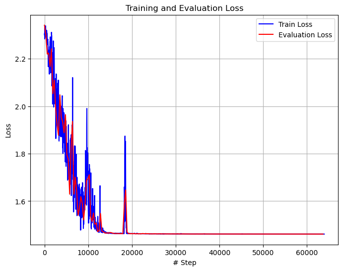 | 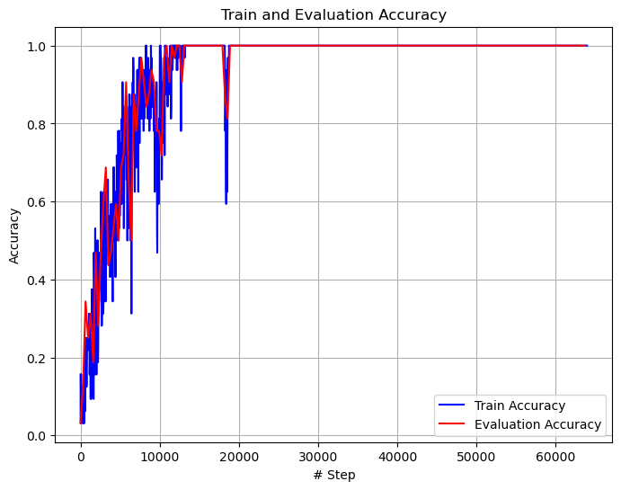 |
| 20     | 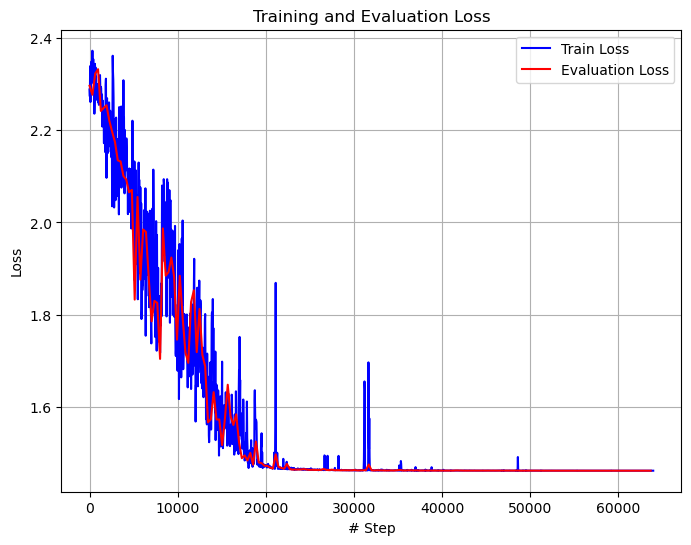 | 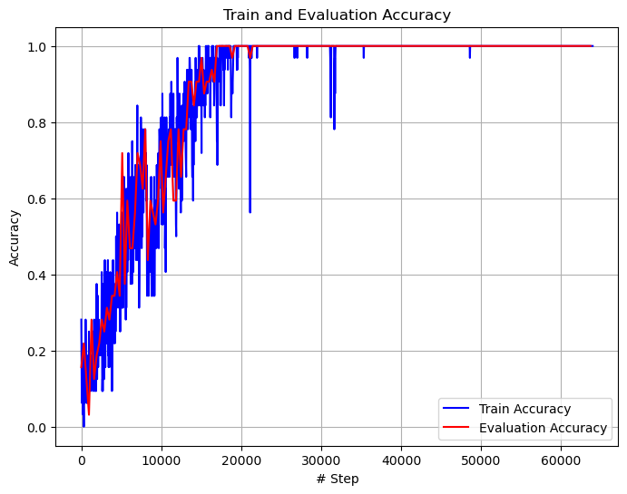 |
| 25     | 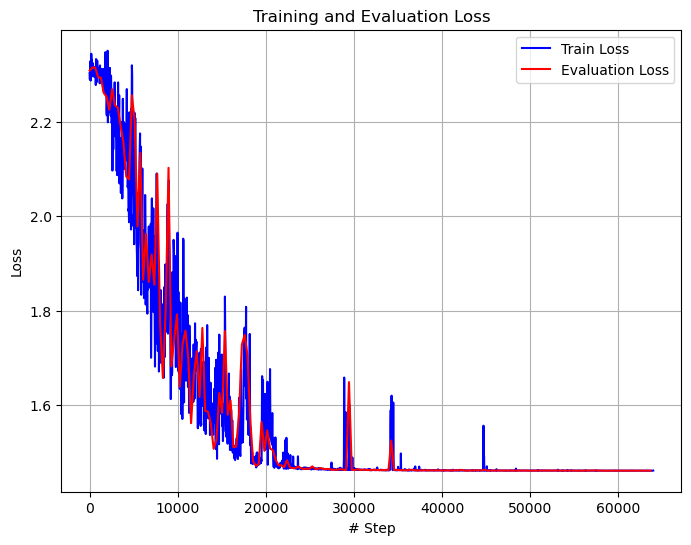 | 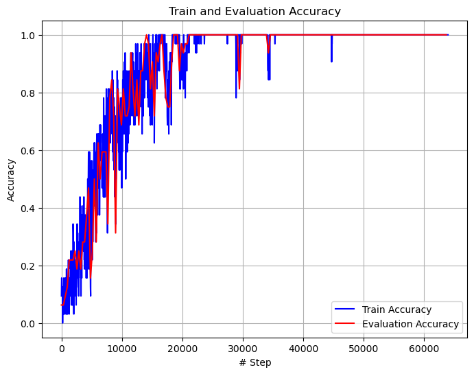 |
| 30     | 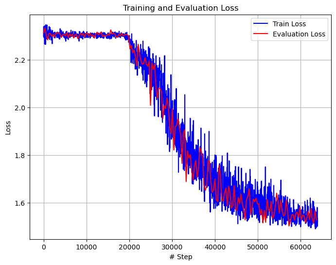 | 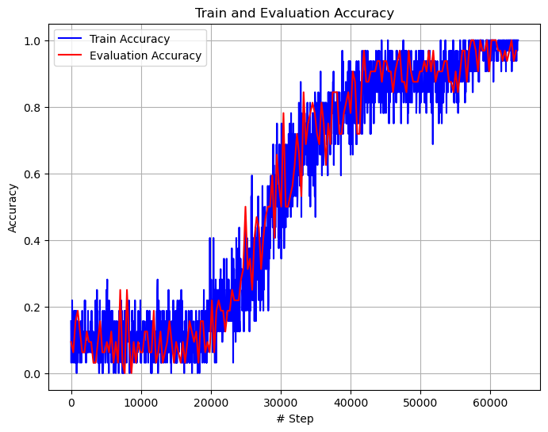 |

From the training curves above, it easy to find out that LSTM can easily handle input length of 10, 20, and even 25, which accuracies equal 100%. LSTM is much bette than RNN in assignment 2. When the input length reach 30, it begin a little bit hard but still gain a 90% accuracy.


## Part II: GAN (60 points)

* Models: GAN
* Datasets: `MNIST` (a classical hand-writing number set, from 0 to 9)
* File structure:

```cmd
.
├── data										# downloaded dataset MNIST
├── mnist_generator.pt			# saved model of GAN
├── my_gan.py								# core
├── task2
├── task2.ipynb
├── task3
└── task3.ipynb
```


### 2.1 Task 1 Implementation

The Generative Adversarial Network (GAN) has two parts, a Generator and a Discriminator. The generator takes noise as input and generate a fake images to fool the discriminator. The distribution of generated data should be similar to the real data. By contrast, the discriminator takes real data and (generated) fake data as input, and try to figure out real or fake the input is. There are various types of GAN's network, such as Fully connected (FC), CNN, etc. Here, in this assignment, although the dataset is images, the code is still asked to use FC layers.

There are type class in the code named `Generator`, and `Discriminator`. The implementation is very simple, core codes are shown as below:

```python
# Generator
        self.layers = Sequential(
            *[Linear(latent_dim, 128), LeakyReLU(0.2)],
            *[Linear(128, 256), BatchNorm1d(256), LeakyReLU(0.2)],
            *[Linear(256, 512), BatchNorm1d(512), LeakyReLU(0.2)],
            *[Linear(512, 1024), BatchNorm1d(1024), LeakyReLU(0.2)],
            Linear(1024, 784), Tanh()
        )

# Discriminator
        self.layers = Sequential(
            *[Linear(784, 512), LeakyReLU(0.2)],
            *[Linear(512, 256), LeakyReLU(0.2)],
            Linear(256, 1), Sigmoid()
        )
```

The training process is significant to whole work. The our optimization objective is:
$$
\min_G \max_D V(D,G) = \min_G \max_D \Big( \mathbb{E}_p [\log D(X)] + \mathbb{E}_q [\log (1-D(G(Z)))] \Big)
$$
The goal of the generator is to minimize the term $log(1 − D(G(z)))$, while the goal of the discriminator is to maximize the both terms (because both terms have $D(\cdots)$, and they are cross entropy as a whole thing at the same time).

So in each training iteration, the code will fix the discriminator to update the generator, and then vise versa (the order is changeable). After finished whole data, the training process will go to next epochs. The pseudocode (as lecture slide shown) of GAN is shown as below:

 

Notably, the update method of generator is descend the gradient of $\log D(G(Z))$ instead of $\log (1- D(G(Z)))$ for a better gradient curves in the range of [0, 1].

Other implement details can be found in code.


### 2.2 Task 2 Samples of Training

Where you can find logs: `task2.ipynb`

Results:

| Begin                   |
| ----------------------- |
| 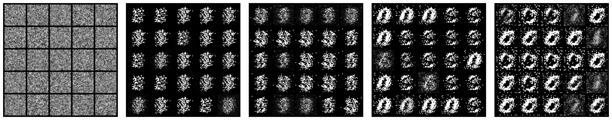 |
| **Middle**              |
| 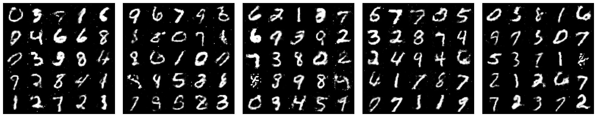 |
| **Final**               |
| 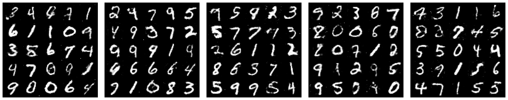 |


### 2.3 Task 3 Samples of Interpolate between two Digits

Interpolate formula: 
$$
f(x) = \frac{x}{n} \text{begin} + \frac{n-x}{n} \text{end} \text{, where } x = 0,\cdots,n
$$
Where you can find logs: `task3.ipynb`

Results:

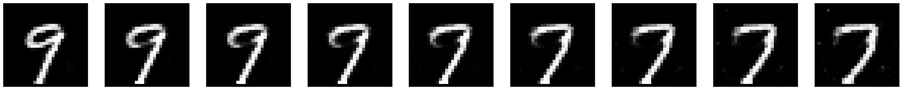

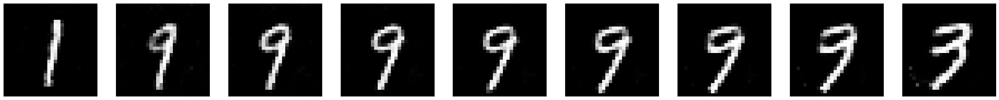

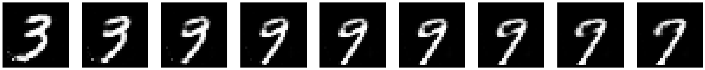

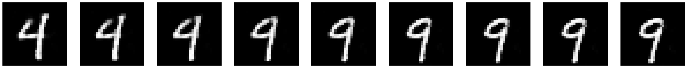


## Acknowledgement

I would like to thank Prof.Zhang, Dr.Wang and all TAs for their excellent work. 👏😀👏
